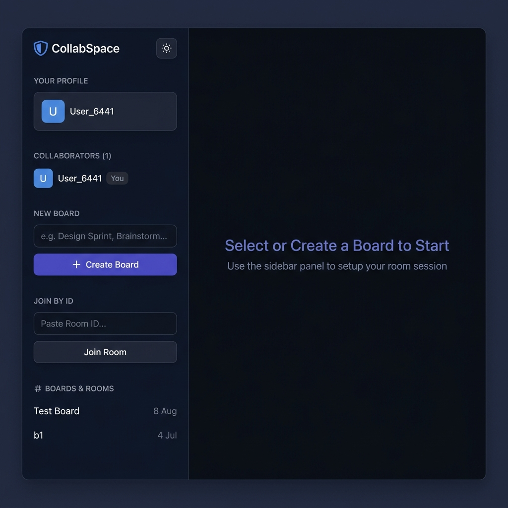
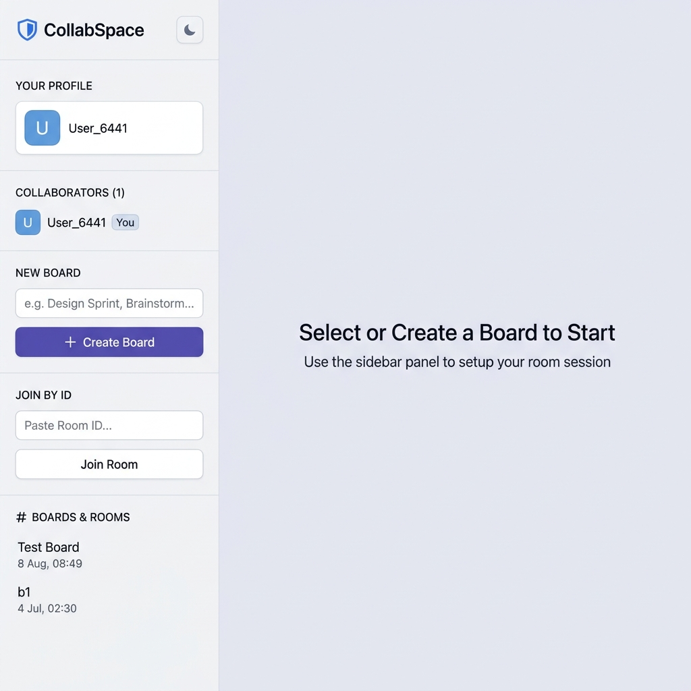

<div align="center">
  
  <h1>CollabSpace</h1>
  <p><strong>Real-time multiplayer collaborative whiteboard — draw, sketch, and brainstorm with your team live.</strong></p>

  <a href="https://collabspace-express.vercel.app">
    
  </a>
  &nbsp;
  
  
  
  
  
  
  

  <br/><br/>

  > **[collabspace-express.vercel.app](https://collabspace-express.vercel.app)** — The frontend is hosted on Vercel.  
  > The backend (Express + Socket.io + Prisma/SQLite) is designed for self-hosting or a Node.js PaaS.  
  > Running locally gives full real-time multiplayer functionality.

</div>

---

## ✨ Features

| Category | Features |
|---|---|
| 🖊️ **Drawing Tools** | Pencil (freehand), Line, Rectangle, Circle, Text, Sticky Note, Eraser, Select |
| 🎨 **Styling** | 8 preset color palettes (Sleek · Pastel · Neon · Earth) + custom HEX picker · Thin/Medium/Thick strokes · Shape fill toggle |
| ⚡ **Real-time** | WebSocket multiplayer via Socket.io — every stroke broadcasts to all connected clients with < 50ms latency |
| 👥 **Presence** | Live cursor tracking with color-coded name badges for every collaborator |
| 🔫 **Laser Pointer** | Ephemeral laser trails (solid, dashed, dotted, rough styles) that fade automatically |
| ↩️ **History** | Full Undo / Redo stack — synced across all peers via the same Socket events |
| 🗺️ **Infinite Canvas** | Scroll to zoom, Shift+drag / middle-click to pan — coordinates are viewport-independent |
| 💾 **Persistence** | Boards and all elements saved to SQLite via Prisma — reload and your work is still there |
| 🔗 **Shareable Rooms** | Every board has a UUID. Share the URL or paste the ID into "Join by Room ID" |
| 📸 **Export** | Export the full canvas to a high-quality PNG in one click |
| 🌗 **Themes** | Polished dark and light modes with system-preference detection, zero flash |
| ⌨️ **Keyboard Shortcuts** | `V` Select · `P` Pencil · `E` Eraser · `L` Line · `R` Rect · `O` Circle · `T` Text · `Ctrl+Z` Undo · `Ctrl+Y` Redo |

---

## 🖥️ Screenshots

| Dark Mode | Light Mode |
|---|---|
|  |  |

---

## 🏗️ Tech Stack

| Layer | Technology |
|---|---|
| **Frontend** | React 19 · Vite 8 · TypeScript · HTML5 Canvas API · Vanilla CSS |
| **Backend** | Node.js · Express 4 · Socket.io 4 |
| **Database** | SQLite via Prisma ORM 5 (easily swapped to Postgres) |
| **Icons** | Lucide React |
| **Fonts** | Outfit (headings) · Inter (body) via Google Fonts |
| **Deploy** | Vercel (frontend) · any Node.js host (backend) |

---

## 📂 Project Structure

```
collabspace/
├── client/                     # React + Vite frontend (Vercel-deployed)
│   ├── public/
│   │   ├── favicon.svg
│   │   └── icons.svg
│   └── src/
│       ├── components/
│       │   ├── DrawingBoard.tsx  # Canvas engine, WebSocket sync, undo/redo, laser, image
│       │   ├── Toolbar.tsx       # Floating tool palette with color/stroke pickers
│       │   └── Sidebar.tsx       # Board management, user presence, theme toggle
│       ├── types.ts              # Shared TypeScript interfaces
│       ├── App.tsx               # Root layout and unified state
│       └── index.css             # Design system & global tokens
├── server/                     # Node.js + Express + Socket.io backend
│   ├── src/
│   │   └── index.ts            # REST API + Socket.io rooms + Prisma CRUD
│   └── prisma/
│       ├── schema.prisma        # Board + Element data models
│       └── migrations/          # Prisma migration history
├── vercel.json                 # Vercel SPA deployment config
├── package.json                # npm workspaces root
└── README.md
```

---

## ⚡ Quick Start (Local — full multiplayer)

### Prerequisites
- Node.js 18+
- npm 9+

### 1. Clone & install

```bash
git clone https://github.com/devtechedge/collabspace-express.git
cd collabspace-express
npm install
```

### 2. Configure environment

```bash
cp client/.env.example client/.env
# Edit client/.env if you want to point to a remote backend:
# VITE_API_URL=https://your-backend.example.com
```

### 3. Set up the database

```bash
cd server
npx prisma migrate dev
npx prisma generate
cd ..
```

### 4. Start both servers

```bash
npm run dev
```

| Service | URL |
|---|---|
| Frontend | http://localhost:5173 |
| Backend API + WebSocket | http://localhost:5000 |

### 5. Collaborate

1. Open `http://localhost:5173` in **two browser windows**
2. **Create Board** in the sidebar — a unique room is generated
3. Copy the URL or Room ID and open it in the second window
4. Draw in either — changes appear instantly in the other window ⚡

---

## 🌐 Deployment

### Frontend → Vercel (one click)

[](https://vercel.com/new/clone?repository-url=https://github.com/devtechedge/collabspace-express)

- `vercel.json` is pre-configured: build command, output dir, and SPA rewrites are set.
- Set `VITE_API_URL` in Vercel's Environment Variables to point to your backend.

### Backend → Any Node.js Host

```bash
cd server
npm run build        # compiles TypeScript → dist/
npm start            # runs dist/index.js
```

Recommended hosts: **Railway**, **Render**, **Fly.io**, **Heroku**.

> **Note:** The SQLite database (`dev.db`) lives next to the server process. For production, swap the Prisma provider to `postgresql` and set `DATABASE_URL`.

---

## 🔌 API Reference

### REST Endpoints

| Method | Endpoint | Description |
|---|---|---|
| `GET` | `/api/boards` | List all boards ordered by last updated |
| `POST` | `/api/boards` | Create a new board `{ name: string }` |
| `GET` | `/api/boards/:id` | Get board details + all saved elements |
| `PATCH` | `/api/boards/:id` | Rename board or update background color |
| `DELETE` | `/api/boards/:id` | Delete board and all its elements |

### Socket.io Events

**Client → Server (emit)**

| Event | Payload | Description |
|---|---|---|
| `join-room` | `{ boardId, userName }` | Join a collaboration room |
| `draw-element` | `{ boardId, element }` | Upsert a drawing element |
| `delete-element` | `{ boardId, elementId }` | Delete an element |
| `cursor-move` | `{ boardId, userName, color, x, y }` | Broadcast cursor position |
| `laser-move` | `{ boardId, userName, color, points }` | Broadcast laser trail points |
| `clear-board` | `{ boardId }` | Clear all elements on the board |
| `rename-board` | `{ boardId, name }` | Broadcast board rename to room |
| `update-board-bg` | `{ boardId, backgroundColor }` | Broadcast background color change |

**Server → Client (listen)**

| Event | Description |
|---|---|
| `canvas-history` | Receive saved elements + background on room join |
| `element-update` | New or updated element from a peer |
| `element-delete` | An element was deleted by a peer |
| `cursor-update` | Updated remote cursor position |
| `laser-update` | Remote laser trail points |
| `board-renamed` | A peer renamed the board |
| `board-bg-updated` | A peer changed the board background |
| `canvas-cleared` | The board was cleared by a peer |
| `user-left` | A collaborator disconnected |

---

## 🧠 Architecture Notes

- **Optimistic updates** — Strokes render locally and broadcast simultaneously, giving zero perceived latency.
- **Upsert persistence** — Each element has a stable UUID. `element.upsert` means partial moves and updates don't create duplicates.
- **Throttled events** — Cursor and laser events are throttled to ~30 fps to avoid flooding the WebSocket connection.
- **Infinite canvas** — Zoom/pan transforms are applied at render time; all coordinates are stored in untransformed canvas-space.
- **zIndex layering** — Bring-to-front / send-to-back updates zIndex in DB and re-sorts the render stack for all peers.

---

## 🎨 Design System

| Token | Value | Usage |
|---|---|---|
| `--accent-primary` | `#6366f1` (Indigo) | Buttons, active states, highlights |
| `--accent-secondary` | `#0ea5e9` (Sky) | Secondary accents, links |
| `--bg-app` (dark) | `#0b0f17` | App background |
| `--bg-sidebar` (dark) | `#10141e` | Sidebar / panel backgrounds |
| Font (headings) | Outfit 400–800 | Logo, section titles |
| Font (body) | Inter 300–700 | All body text, labels |

Glassmorphism (`backdrop-filter: blur(16px)`) is applied to the toolbar and sidebar overlays for a premium layered feel.

---

## 🤝 Contributing

Contributions are welcome! Please read [CONTRIBUTING.md](CONTRIBUTING.md) before submitting a pull request.

1. Fork the repository
2. Create your feature branch: `git checkout -b feat/my-feature`
3. Commit your changes: `git commit -m 'feat: add my feature'`
4. Push to the branch: `git push origin feat/my-feature`
5. Open a Pull Request

---

## 📄 License

Distributed under the [MIT License](LICENSE).

---

<div align="center">
  <sub>Built with ❤️ by <a href="https://github.com/devtechedge">devtechedge</a></sub>
</div>
