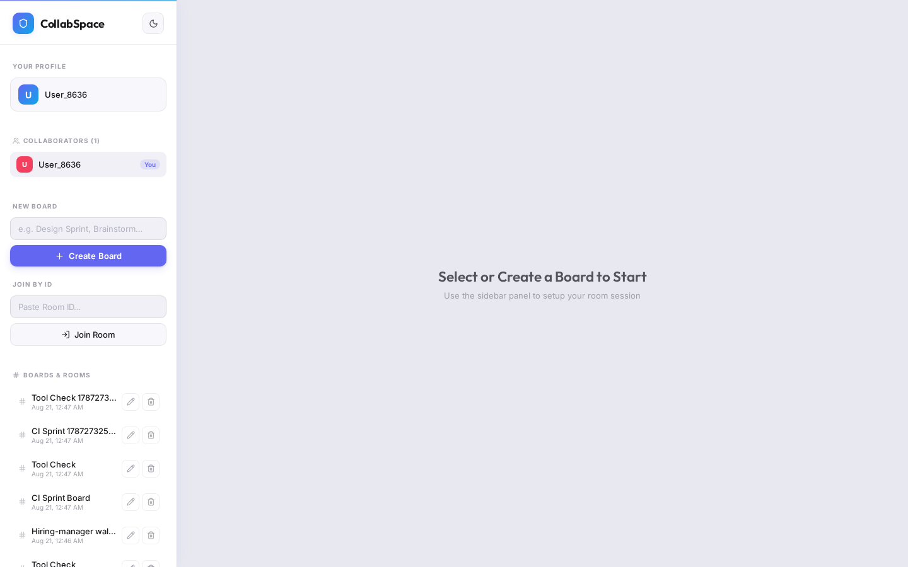

# CollabSpace Express

Real-time multiplayer whiteboard — infinite canvas, live cursors, and Prisma-backed rooms.

[](https://collabspace-express.vercel.app)
[](https://github.com/devtechedge/collabspace-express/actions/workflows/ci.yml)
[](https://react.dev/)
[](https://vite.dev/)
[](https://www.typescriptlang.org/)
[](https://expressjs.com/)
[](https://socket.io/)
[](https://www.prisma.io/)
[](LICENSE)

---

## Live Demo

**https://collabspace-express.vercel.app**

> **Status:** Vercel hosts the **Vite client**. There is no public Express/Socket.io process on that URL. When the API is unreachable the client falls back to **localStorage boards** so the live demo is still drawable. Clone and `npm run dev` for real multiplayer (two browser windows on the same room ID).
>
> This is not a production auth or payment product. Identity is an anonymous display name in `localStorage`.

---

## Screenshots

### Dark canvas


### Light canvas


### Empty board


---

## Features

- **11 drawing tools** — pencil, highlighter, line, rectangle, circle, text, sticky note, eraser, select, image, laser pointer
- **Live collaboration** — Socket.io rooms, color-coded cursors, laser trails, presence list
- **Infinite canvas** — scroll zoom, Shift-drag / middle-click pan, grid overlay
- **Undo / redo** — local history, broadcast to peers
- **Shareable rooms** — UUID in the URL (`?room=`), join-by-ID in the sidebar
- **Persistence** — boards and elements in SQLite via Prisma (local backend)
- **PNG export**, dark / light theme, keyboard shortcuts (`V` `P` `E` `L` `R` `O` `T`)

---

## Tech Stack

| Layer | Technology |
|-------|------------|
| Frontend | React 19, Vite 8, TypeScript, HTML5 Canvas, Lucide |
| Realtime | Socket.io 4 |
| API | Express 4 |
| Data | Prisma 5 + SQLite (swap the provider for Postgres locally) |
| Hosting | Vercel (client). Express is **local** |
| CI | GitHub Actions |

---

## Quick Start

```bash
git clone https://github.com/devtechedge/collabspace-express.git
cd collabspace-express
npm install

cp client/.env.example client/.env
cp server/.env.example server/.env

cd server && npx prisma migrate dev && npx prisma generate && cd ..

npm run dev
```

| Service | URL |
|---------|-----|
| Client | http://localhost:5173 |
| API + WebSocket | http://localhost:5000 |

Open two windows, create a board, paste the room ID in the second — strokes sync live.

---

## Project shape

```
client/                 Vite + React UI (Vercel)
  public/favicon.svg
  src/components/       DrawingBoard, Toolbar, Sidebar
server/                 Express + Socket.io + Prisma
  prisma/schema.prisma
  src/index.ts
```

Prisma is the local production path, not leftover template. The public Vercel alias does not run this server.

---

## Quality

| Check | How |
|-------|-----|
| Unit | Allow-lists, payload sanitizer, board-name rules, element upsert (`npm test`) |
| Types | `npm run typecheck` — server `tsc --noEmit`, client `tsc -b` |
| E2E | Playwright Chromium: shell, create board, pencil tool, theme toggle |
| CI | GitHub Actions — install → Prisma generate → unit → typecheck → e2e |
| Supply chain | Unused Testing Library removed; Dependabot weekly (patch/minor only — do not merge majors blindly) |

```bash
npm test
npm run typecheck
npx playwright install chromium
npm run test:e2e
```

---

## Security

Portfolio demo: **no login**. Vercel cannot reach other users' boards.

The local Express engine allow-lists element types, clamps strokes, caps payload size, and reads `CORS_ORIGIN`. **Do not bind port 5000 to the internet** without auth and a locked origin.

Details: **[SECURITY.md](SECURITY.md)**.

---

## License

MIT. See [LICENSE](LICENSE).
